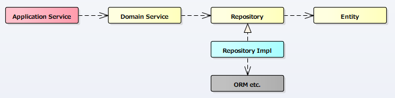
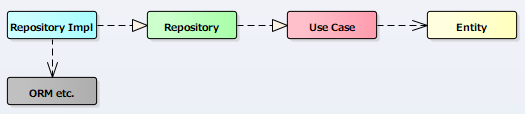

# DDDとClean Architectureで位置づけが異なることについて
リポジトリは、「実践ドメイン駆動設計」ではドメインレイヤに属すとされているのに対し、
「Clean Architecture」ではユースケースレイヤに属すとされている。
それぞれレイヤが異なるので混乱したが、おそらく「集約を誰がインスタンス化するか」に対する考え方が異なるためにことに起因しているのだと思う。(以下推測)

## 実践ドメイン駆動設計での扱い
集約(Aggregateだが、図ではEnityと書いている)をインスタンス化する手段はドメイン層の中にあるべきという考えがあり、リポジトリはドメイン層に属しているのではないかと思う。

「第7章 サービス」で「経験上、集約の内部からリポジトリを使うことは、できるだけ避けるべきだ」と書かれているように、
ドメインサービスから操作されるので、依存関係は下図のようになる。

* 赤: アプリケーションレイヤ
* 黄: ドメインレイヤ
* 青: インフラストラクチャレイヤ

## Clean Architectureでの扱い
集約をインスタンス化するのはドメインの外部(ユースケース:実践ドメイン駆動設計におけるドメインサービス)であればよいという考えがあるために、
リポジトリはGatewaysに属しているのではないかと思う。

リポジトリはユースケースに依存(依存関係の逆転)し、ユースケースが必要とする機能を提供する役割がある。
なので、直接Entitiesに依存しなくても良い(しても良い)とも言える。

* 黄: Entities
* 赤: Use Cases
* 緑: Gateways/Controllers/Presenters
* 青: DB/Web/UI etc...

## まとめ
「実践ドメイン駆動設計」では集約のインスタンス化はドメイン層内にあるという考えがあり、「Clean Architecture」ではそれがユースケースにあるという考えがあり、この違いによりリポジトリの位置が異なるのだと思う。